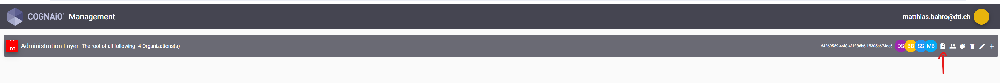
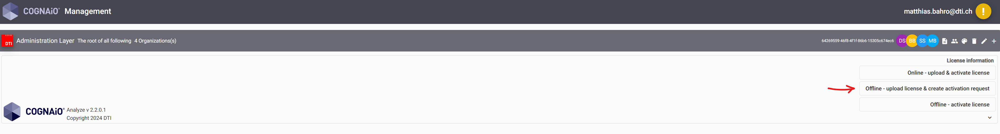
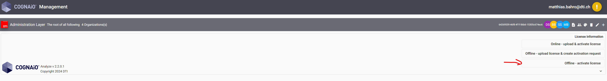
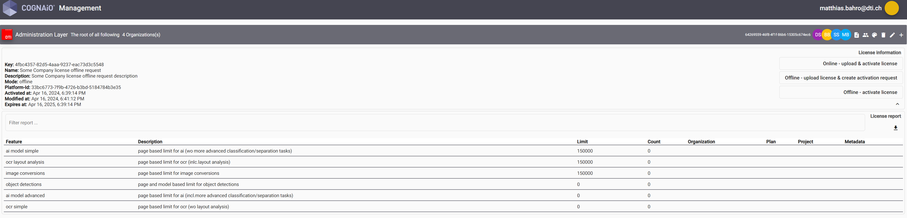

# Helm Repository for COGNAiO® Cloud Extract
This chart bootstraps a [COGNAiO®](https://dti.group/en/) cloud extract deployment on a [Kubernetes](https://kubernetes.io/) cluster using the [Helm](https://helm.sh/) package manager.

## Deployment Instructions
This repository provides a microservices architecture deployment setup, managed via [Helm](https://helm.sh/). The microservices are containerized, and images are hosted on our private image registry. Customers have the following options for obtaining these images:

### Pull Images from Our Registry (default)
Customers can pull images directly from our private registry. To do this, please **contact us to obtain the required credentials**. Once you receive the credentials, update your Helm configuration with the authentication details to access our registry.

### Receive Images Directly (alternative)
If you prefer not to connect directly to our registry, we can provide you with the images. Please **get in touch with us** to arrange image delivery. After receiving the images, import them into your local registry, and update the Helm configuration to reference your local repository.

### Ongoing Updates
Our team actively maintains this repository, providing updates to Helm charts and container images to ensure that bug fixes, security patches, and new feature versions are available. These updates are publicly accessible through this GitHub repository. Please check regularly or subscribe to notifications to stay informed about the latest releases.

### Migration and Backup

Our application images are fully stateless, with all persistent data stored exclusively in the database. This design ensures that ongoing updates and new deployments are seamless, as no data is stored within the application containers themselves. Because of this stateless architecture, customers can confidently update to new versions without disrupting application functionality or data integrity.

The data stored in the database is limited to statistical data, license information, and application configuration; no customer data is stored. For customers updating to a new version, our setup includes a migration init pod that handles all necessary database migrations. This process ensures a smooth transition to the latest version without manual intervention.

The database is the only component requiring a backup, as no other data storage is used in this setup. We strongly recommend backing up the database before any update to safeguard against data loss during the migration process.

To ensure all updates work as expected, we recommend testing deployments in a **staging environment** prior to deploying to production. This allows you to verify the functionality and compatibility of the new version in a controlled setting.


## Prerequisites
### Tools & Skills
- Basic knowledge of Helm and deployments in Kubernetes
- [Install Az Cli](https://learn.microsoft.com/en-us/cli/azure/install-azure-cli)
- [Install Kubectl](https://kubernetes.io/docs/tasks/tools/install-kubectl-windows/)
- [Install Helm](https://helm.sh/docs/intro/install/)
- Running [Infrastructure for COGNAiO®](https://github.com/dti-cognaio/cognaio-cloud-extract-iac) cloud extract
- Right Permissions in Azure and needed resources
  - Make sure the user or service principal who deploys this Helm Charts has the right permission in the AKS Azure resource (RBAC Cluster Admin Role)

### Connect to Cluster (Azure)
Get the according information form Azure Portal
```sh
az login
```
```sh
az account set --subscription <Subscription>
```
```sh
az aks get-credentials --resource-group <RessourceGroup> --name <AKS-Name>
```

## Configuration and installation details
### Secrets
All secrets can be individually controlled via the property `secret.init`, whether they should be created automatically by the deployment or not. If they are to be created, the required parameters must be filled in - see further descriptions below. If not, the already created secret can be used via `secret.name`.

### Cognitive Service Endpoints
Our application integrates with multiple Azure resources, which are detailed in our [infrastructure](https://github.com/dti-cognaio/cognaio-cloud-extract-iac) GitHub repository. However, certain configuration details for deploying COGNAiO® Cloud Extract must be retrieved directly from the Azure portal. Please navigate to each relevant resource and locate the required endpoint information.

While Azure is our preferred platform for AI services, our solution also supports a variety of alternatives, including AWS, ChatGPT, DeepSeek, Gemini, and more.

### Azure
|Name                                                                 | Resource                                              | Example / Description                                                            |
|:--------------------------------------------------------------------|:------------------------------------------------------|:---------------------------------------------------------------------------------|
|`cognaioservice.env.ai.apikeyAzureOpenAi`                            | Microsoft.CognitiveServices - Kind: OpenAI            | See Azure Portal on the Resource --> Resource Management --> `Keys and Endpoint` |
|`cognaioservice.env.ai.endpointAzureOpenAi`                          | Microsoft.CognitiveServices - Kind: OpenAI            | `https://<RESOURCE NAME>.openai.azure.com`                                       |
|`cognaioservice.env.ai.apikeyAzureAiDocumentIntelligence`            | Microsoft.CognitiveServices - Kind: FormRecognizer    | See Azure Portal on the Resource --> Resource Management --> `Keys and Endpoint` |
|`cognaioservice.env.ai.endpointAzureAiDocumentIntelligence`          | Microsoft.CognitiveServices - Kind: FormRecognizer    | `https://<RESOURCE NAME>.cognitiveservices.azure.com/`                           |
|`cognaioservice.env.ai.apikeyAzureCognitiveServicesComputervision`   | Microsoft.CognitiveServices - Kind: CognitiveServices | See Azure Portal on the Resource --> Resource Management --> `Keys and Endpoint` |
|`cognaioservice.env.ai.endpointAzureCognitiveServicesComputerVision` | Microsoft.CognitiveServices - Kind: CognitiveServices | `https://<LOCATION>.api.cognitive.microsoft.com/`                                |

### AWS
|Name                                                                 | Resource                                              | Example / Description                                                                                  |
|:--------------------------------------------------------------------|:------------------------------------------------------|:-------------------------------------------------------------------------------------------------------|
|`cognaioservice.env.aws.accesskeyIdAwsTextract`                      | Amazon Textract resource                              | Create a service user in AWS with resource access and generate the corresponding access and secret key.|
|`cognaioservice.env.aws.secretAccessKeyAwsTextract`                  | Amazon Textract resource                              | Create a service user in AWS with resource access and generate the corresponding access and secret key.|
|`cognaioservice.env.aws.regionAwsTextract`                           | Amazon Textract resource region                       | `eu-central-1`                                                                                         |
|`cognaioservice.env.aws.accesskeyIdAwsBedrock`                       | Amazon Textract resource                              | Create a service user in AWS with resource access and generate the corresponding access and secret key.|
|`cognaioservice.env.aws.secretAccessKeyAwsBedrock`                   | Amazon Textract resource                              | Create a service user in AWS with resource access and generate the corresponding access and secret key.|
|`cognaioservice.env.aws.regionAwsBedrock`                            | Amazon Textract resource region                       | `eu-central-1`                                                                                         |

### Other Ai Services
If you want to use other Ai services you can provide following information otherwise it can be empty.
|Name                                           | Resource            | Example / Description                                 |
|:----------------------------------------------|:--------------------|:------------------------------------------------------|
|`cognaioservice.env.ai.apikeyNativeOpenAi`     | openai.io           | Create individual ApiKey in your openAi account       | 
|`cognaioservice.env.ai.endpointNativeOpenAi`   | openai.io           |`"https://api.openai.com/v1"`                          |
|`cognaioservice.env.ai.apikeyNativeGemini`     | google Gemini       |`"https://gemini.google.com/app"`                      |
|`cognaioservice.env.ai.apikeyNativeAnthropic`  | Amazon Anthropic    |`"https://api.openai.com/v1"`                          |
|`cognaioservice.env.ai.apikeyNativeCerebral`   | Cerebral            |`"https://cerebralai.com.au/"`                         |
|`cognaioservice.env.ai.endpointNativeCerebral` | Cerebral            |`"https://cerebralai.com.au/"`                         |

### PassPhrases and Tokens
The PassPhrases and tokens are needed to encrypt the database tables and the jwt tokens used in the application. These are mostly independent of each other except `emailservice.env.passPhraseCryptoSymetricAppKey` and `cognaioservice.env.tokens.passPhraseCryptoSymetricAppKey` these must have the same value. The value can be any string of at least 8 characters.

| Name                                                                                     | Description                     | Default                                                                     |
|:-----------------------------------------------------------------------------------------|:--------------------------------|:----------------------------------------------------------------------------|
| `cognaioservice.env.tokens.passPhraseAuditArtifacts`                                     | Pass phrase token               | `""`                                                                        |
| `cognaioservice.env.tokens.passPhraseDefinitions`                                        | Pass phrase token               | `""`                                                                        |
| `cognaioservice.env.tokens.passPhraseTemplates`                                          | Pass phrase token               | `""`                                                                        |
| `cognaioservice.env.tokens.passPhraseCryptoAsymetric`                                    | Pass phrase token               | `""`                                                                        |
| `cognaioservice.env.tokens.passPhraseCryptoSymetric`                                     | Pass phrase token               | `""`                                                                        |
| `cognaioservice.env.tokens.tokenEncryptionTokenJwtKey`                                   | Pass phrase token               | `""`                                                                        |
| `cognaioservice.env.tokens.passPhraseAccessTokenJwtKey`                                  | Pass phrase token               | `""`                                                                        |
| `cognaioservice.env.tokens.passPhraseRefreshTokenJwtKey`                                 | Pass phrase token               | `""`                                                                        |
| `cognaioservice.env.tokens.passPhraseUnsubscribeTokenJwtKey`                             | Pass phrase token               | `""`                                                                        |
| `cognaioservice.env.tokens.passPhraseExportTokenJwtKey`                                  | Pass phrase token               | `""`                                                                        |
| `cognaioservice.env.tokens.passPhraseMailboxesTokenJwtKey`                               | Pass phrase token               | `""`                                                                        |
| `cognaioservice.env.tokens.passPhraseEnvelopesTokenJwtKey`                               | Pass phrase token               | `""`                                                                        |
| `cognaioservice.env.tokens.passPhraseRegisterTokenJwtKey`                                | Pass phrase token               | `""`                                                                        |
| `cognaioservice.env.tokens.passPhraseOtpTokenJwtKey`                                     | Pass phrase token               | `""`                                                                        |
| `cognaioservice.env.tokens.passPhraseAppKeyJwtKey`                                       | Pass phrase token               | `""`                                                                        |
| `cognaioservice.env.tokens.passPhraseCryptoSymetricAppKey`                               | Pass phrase token               | `""` (Same as `emailservice.env.passPhraseCryptoSymetricAppKey`)            |
| `cognaioservice.env.tokens.passPhraseAnalyzeFromContentJwtKey`                           | Pass phrase token               | `""`                                                                        |
| `cognaioservice.env.tokens.passPhraseAnalyzeResponseDownloadJwtKey`                      | Pass phrase token               | `""`                                                                        |
| `cognaioflexsearchservice.env.passPhrase_Repositories`                                   | Pass phrase token               | `""`                                                                        |
| `emailservice.env.passPhraseCryptoSymetricAppKey`                                        | Pass phrase token               | `""` (Same as `cognaioservice.env.tokens.passPhraseCryptoSymetricAppKey`)   |

### Mail Account
In order for the application to send email notifications for licensing, project management and generation of one-time passwords, an email inbox is required. 
| Name                                                                                     | Description                                            | Default                                                                                      |
|:-----------------------------------------------------------------------------------------|:-------------------------------------------------------|:---------------------------------------------------------------------------------------------|
| `cognaioservice.env.mailAccount.user`                                                    | Mail account user                                      | `""`                                                                                         |
| `cognaioservice.env.mailAccount.password`                                                | Mail account password                                  | `""`                                                                                         |
| `cognaioservice.env.mailAccount.host`                                                    | Mail account host                                      | `smtp.office365.com`                                                                         |
| `cognaioservice.env.mailAccount.port`                                                    | Mail account port                                      | `587`                                                                                        |
| `cognaioservice.env.organization.users`                                                  | Array of users to manage COGNAiO Cloud Extract         | `""`                                                                                         |
| `cognaioservice.env.organization.fromAddressFriendlyName`                                | From address friendly name                             | `Cognaio`                                                                                    |
| `cognaioservice.env.organization.useAdvancedAuth`                                        | Use advanced authentication methods as json            | `{"auth":{"user":"yourEmailAddress","pass":"yourPassword"}}                                  |
| `cognaioservice.env.organization.advancedAuthJson`                                       | Array of users to manage COGNAiO Cloud Extract         | `""`                                                                                         |
| `cognaioservice.env.organization.useCustomSettings`                                      | Boolean to use custom settings                         | `false`                                                                                      |
| `cognaioservice.env.organization.customSettingsJson`                                     | Apply custom settings as json                          | `{"secure":false,"maxConnections":150,"tls":{"ciphers":"SSLv3","rejectUnauthorized":false}}  |
The emails are sent to so-called organization users which emails can be configured in the following array property.
Please note the exact spelling with **“'name1','name2'”**
```yaml
cognaioservice:
  env:
    organization:
      users: "'email_1@example.com','email_2@example.com'"
```
> Change from version 2.2.0 to 2.2.1 | new provide string instead of array
### Database
Some microservices require a postgres database to persist certain data. the following parameters are described for this purpose.
| Name                                                                                  | Description                                               | Default                                              |
|:--------------------------------------------------------------------------------------|:----------------------------------------------------------|:-----------------------------------------------------|
| `cognaioservice.env.db.postgreSqlUser`                                                | postgreSQL username                                       | `<SQL-USER>`                                         |
| `cognaioservice.env.db.postgreSqlPwd`                                                 | postgreSQL password                                       | `<SQL-PASSWORD>`                                     |
| `cognaioservice.env.db.postgreSqlDbServer`                                            | postgreSQL server                                         | `<SQL-SERVER>`                                       |
| `cognaioservice.env.db.postgreSqlDbPort`                                              | postgreSQL port                                           | `5432`                                               |
| `cognaioservice.env.db.postgreSqlSslRequired`                                         | postgreSQL ssl required flag                              | `true`                                               |
| `cognaioservice.env.db.postgreSqlDbName`                                              | postgreSQL database name                                  | `postgres`                                           |
| `cognaioservice.env.db.schemas`                                                       | postgreSQL schemas                                        | `cognaio_extensions; cognaio_design; cognaio_audits` |
| `cognaioflexsearchservice.env.db.postgreSqlUser`                                      | postgreSQL username                                       | `<SQL-USER>`                                         |
| `cognaioflexsearchservice.env.db.postgreSqlPwd`                                       | postgreSQL password                                       | `<SQL-PASSWORD>`                                     |
| `cognaioflexsearchservice.env.db.postgreSqlDbServer`                                  | postgreSQL server                                         | `<SQL-SERVER>:<PORT>`                                |
| `cognaioflexsearchservice.env.db.postgreSqlDbPort`                                    | postgreSQL port                                           | `5432`                                               |
| `cognaioflexsearchservice.env.db.postgreSqlSslRequired`                               | postgreSQL ssl required flag                              | `true`                                               |
| `cognaioflexsearchservice.env.db.postgreSqlDbName`                                    | postgreSQL database name                                  | `postgres`                                           |
| `cognaioflexsearchservice.env.db.schemas`                                             | postgreSQL schemas                                        | `cognaio_extensions; cognaio_repositories`           |

### Redis
Some microservices require a Redis cache for caching certain data. Persistence is not needed.
| Name                                                                                  | Description                                               | Default                                              |
|:--------------------------------------------------------------------------------------|:----------------------------------------------------------|:-----------------------------------------------------|
| `redis.secret.name`                                                                   | Secret name                                               | `redis-secrets`                                      |
| `redis.secret.init`                                                                   | Whether or not to create a secret                         | `true`                                               |
| `redis.secret.password`                                                               | Whether or not to create a secret                         | `changeme`                                           |
| `redis.secret.providerUrl`                                                            | Whether or not to create a secret                         | `redis://:changeme@redis:6379`                       |

### Additional Parameter
The following table lists the important configurable parameters of the COGNAiO cloud extract chart and their default values. All other parameters can be taken from values.yaml
| Name                                                                                     | Description                                                        | Default                                              |
|:-----------------------------------------------------------------------------------------|:-------------------------------------------------------------------|:-----------------------------------------------------|
| `image.containerRegistry`                                                                | Container registry where all images are placed                     | `dtideregistry.azurecr.io`                           |
| `cognaio.namespace`                                                                      | Kubernetes namespace for the deployment                            | `cognaio-idp`                                        |
| `cognaio.url`                                                                            | Base URL to COGNAiO App                                            | `<YOUR-BASE-URL>`                                    |
| `cognaio.wildcardUrl`                                                                    | Base URL wildcard for ingress                                      | `<WILDCARD-VARIATION-OF-BASE-URL>`                   |
| `cognaio.cert.certificate`                                                               | Certificate for TLS termination in pem format                      | `""`                                                 |
| `cognaio.cert.key`                                                                       | Certificate Key for TLS termination in pem format                  | `""`                                                 |
| `cognaio.cert.secret.name`                                                               | Secret name, details in `cognaio-tls-secret.yaml`                  | `cognaio-com-tls-secret`                             |
| `cognaio.cert.secret.init`                                                               | Whether or not to create a secret                                  | `true`                                               |
| `cognaio.ingress.enabled`                                                                | Enable deployment of ingress                                       | `true`                                               |
| `cognaiostudio.service.urlpath`                                                          | Url path for the service                                           | `/cognaioalnalyze`                                   |
| `cognaiostudio.resources`                                                                | Provide limit and request resource information                     | none                                                 |
| `cognaioservice.service.urlpath`                                                         | Url path for the service                                           | `/extraction`                                        |
| `cognaioservice.env.port`                                                                | Port                                                               | `3000`                                               |
| `cognaioservice.env.secret.name`                                                         | Secret name, details in `cognaioservice-env-secrets.yaml`          | `cognaioservice-env-secrets`                         |
| `cognaioservice.env.secret.init`                                                         | Whether or not to create a secret                                  | `true`                                               |
| `cognaioservice.env.cognitiveServices.computervision.maxRequestTimeoutInSec`             | Max request timeouts in seconds                                    | `6`                                                  |
| `cognaioservice.env.cognitiveServices.computervision.maxRetries`                         | Max retries                                                        | `30`                                                 |
| `cognaioservice.env.cognitiveServices.computervision.maxRetriesWaitTimeoutInSec`         | Max retries wait timeout in seconds                                | `1`                                                  |
| `cognaioservice.env.cognitiveServices.computervision.maxWaitTimeoutForFinishedInSec`     | Max wait timeouts for finished in seconds                          | `1`                                                  |
| `cognaioservice.env.cognitiveServices.aiDocumentIntelligence.maxRequestTimeoutInSec`     | Max request timeouts in seconds                                    | `10`                                                 |
| `cognaioservice.env.cognitiveServices.aiDocumentIntelligence.maxRetries`                 | Max retries                                                        | `30`                                                 |
| `cognaioservice.env.cognitiveServices.aiDocumentIntelligence.maxRetriesWaitTimeoutInSec` | Max retries wait timeouts in seconds                               | `1`                                                  |
| `cognaioservice.env.cognitiveServices.awsTextract.maxRequestTimeoutInSec`                | Max request timeouts in seconds                                    | `10`                                                 |
| `cognaioservice.env.cognitiveServices.awsTextract.maxRetries`                            | Max retries                                                        | `30`                                                 |
| `cognaioservice.env.cognitiveServices.awsTextract.maxRetriesWaitTimeoutInSec`            | Max retries wait timeouts in seconds                               | `3`                                                  |
| `cognaioservice.env.essentials.warningNotificationTimeoutInHours`                        | Warning notification timeouts in hours                             | `48`                                                 |
| `cognaioservice.env.essentials.featureExceedsLimitsNotificationTimeoutInDays`            | Feature exeeds limits notification timout in days                  | `2`                                                  |
| `cognaioservice.env.environmentNameForNotifications`                                     | Displayname of the notification service                            | `Cognaio IDP`                                        |
| `cognaioservice.env.logSeverity`                                                         | Log severity                                                       | `info`                                               |
| `cognaioservice.resources`                                                               | Provide limit and request resource information                     | none                                                 |
| `emailservice.env.port`                                                                  | Port                                                               | `7171`                                               |
| `emailservice.env.logSeverity`                                                           | Log severity                                                       | `info`                                               |
| `emailservice.env.secret.name`                                                           | Secret name, details in `emailservice-env-secrets.yaml`            | `emailservice-env-secrets`                           |
| `emailservice.env.secret.init`                                                           | Whether or not to create a secret                                  | `true`                                               |
| `emailservice.resources`                                                                 | Provide limit and request resource information                     | none                                                 |
| `cognaioflexsearchservice.env.port`                                                      | Port                                                               | `8688`                                               |
| `cognaioflexsearchservice.env.logSeverity`                                               | Log severity                                                       | `error`                                              |
| `cognaioflexsearchservice.env.secret.name`                                               | Secret name, details in `cognaioflexsearchservice-env-secrets.yaml`| `cognaioflexsearchservice-env-secrets`               |
| `cognaioflexsearchservice.env.secret.init`                                               | Whether or not to create a secret                                  | `true`                                               |
| `cognaioflexsearchservice.resources`                                                     | Provide limit and request resource information                     | none                                                 |
| `imageprovider.env.port`                                                                 | Port                                                               | `3333`                                               |
| `imageprovider.resources`                                                                | Provide limit and request resource information                     | `memory: 5120Mi/512Mi`                               |
| `objectdetectionprovider.env.port`                                                       | Port                                                               | `7337`                                               |
| `objectdetectionprovider.resources`                                                      | Provide limit and request resource information                     | `memory: 5120Mi/512Mi`                               |

## Installing the Chart
Adjust Values in values.yaml according environment or pass a dedicated values.yaml.  

```
helm upgrade cognaio-idp .\idp-core\ --install --create-namespace -n cognaio-idp -f individual-values.yaml
```

Wait until all pods are ready and running
```
kubectl get pods -n cognaio-idp -w
```
|NAME|READY|STATUS|
|:----|:---|:---|
|cognaiostudio-xxx              |1/1|     Running|
|cce-user-manual-xxx            |1/1|     Running|
|cognaioflexsearchservice-xxx   |1/1|     Running|
|cognaioservice-xxx             |1/1|     Running|
|emailservice-xxx               |1/1|     Running|
|imageprovider-xxx              |1/1|     Running|
|nginx-xxx                      |1/1|     Running|
|objectdetectionprovider-xxx    |1/1|     Running|
|redis-xxx                      |1/1|     Running|

## Usage & First Steps
From the values.yaml take the base url:

```yaml
cognaio:
  url: cognaio.example.group
```

Frontend: https://cognaio.example.group/cognaioanalyze

Per default a temporary trial license will be active for a limited amount of time (14 days) and with a limited rate limitation of analyze request (250 requests/day). During this trial phase, it is expected to request and apply an official platform license.
A Platform license describes the available features and their limits and an expiration date. A license can be requested in two modes:

- online, allows online activation, as reporting back the current counts of a license and it´s features to the license server at a certain interval of time

- offline, checking the current feature counts locally at a certain interval of time. exceeding feature limits or expiration date, will raise warnings via email to the current Members of the My Cognaio Administration layer. An offline license also requires an offline activation.

In a dedicated environment only the offline method is recommended.

### Offline license activation
1. enter to My Cognaio via Analyze My Cognaio Login https://cognaio.example.group/cognaioanalyze/mycognaio
2. enter your email address and request a one time password (OTP). The OTP will be send to the email address
3. login using the OTP from the email
4. activation steps as follows

on the Administration layer open the license management panel

upload the license will create an offline activation request file, which is downloaded to the browsers download location.

5. send offline activation request file back to cognaio-license@dti.group and wait for an activation file being send via email from cognaio-license@dti.group

6. upload activation file send from cognaio-license@dti.group


7. Successfully activation
